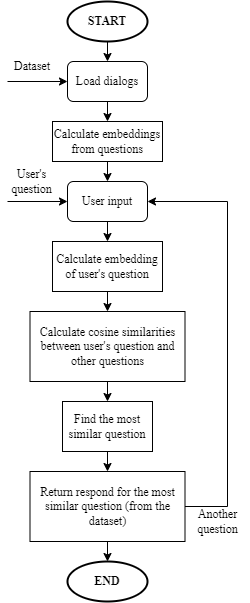

# Dialog-Chatbot
Chatbot based on a set of dialogs with web UI.

Based on dialogs means that the chatbot behavioral is determined by question-response combinations. That practically means that the chatbot has preset responses.

Possible application is for an example as a customer support chatbot. Dataset of the most frequently cast questions in combination with responses for these questions is provided to the chatbot. Then it will handle all of these questions.

With this support example in mind a basic web UI was made to implement the chatbot. Flask was used to implement the chatting model to the web application.

*Showcase one*

*Showcase two*

## Dialogs
Need to note that in this exact example the used dialogs represent just a basic conversation between two people. They aren't a good choice for a support chatbot. It is there as just a showcase of functional example. The dialogs can be found on <https://www.kaggle.com/datasets/grafstor/simple-dialogs-for-chatbot>.

For using other dialogs the program expects following format. Question and response is in one line separated by tab ("\t") symbol.

## Functionality
This chatbot implementation uses a sentence transformation technology. The questions are transformed into numerical vectors and after that the questions are being processed as vectors => easier way to find similarities. This functionality was implemented with sentence-transformers pre-trained model (see <https://github.com/UKPLab/sentence-transformers>).

### Transformation
As mentioned above a pre-trained model was used for the transformation sentences into numerical vectors. The used model can be described as BERT (Bidirectional Encoder Representations from Transformers). BERT assigns words a values and also finds relationships between words. The result is a multidimensional vector representing a sentence.

*Chatbot flowchart*

## Notes
- Instead of form submitting to trigger a post request you can also use a javascript fetch
- Fetching is asynchronous